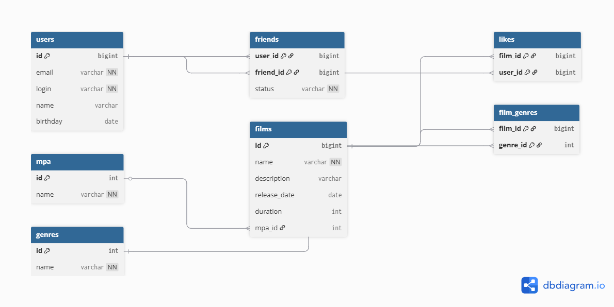

# java-filmorate

Учебный проект Filmorate — сервис для работы с фильмами и пользователями.

## ER-диаграмма базы данных

Ниже представлена схема базы данных проекта Filmorate, отражающая связи между пользователями, фильмами, жанрами, рейтингами MPA и дружбой.



## Описание схемы

### Основные сущности

- **users** — пользователи сервиса
- **films** — фильмы
- **genres** — жанры фильмов
- **mpa** — возрастные рейтинги фильмов (G, PG, PG-13, R, NC-17)

### Связующие таблицы

- **film_genres** — связь фильмов и жанров (many-to-many)
- **likes** — лайки пользователей фильмам
- **friends** — дружба между пользователями с указанием статуса (pending / confirmed)

---

## Примеры запросов

Получение популярных фильмов
SELECT f.*
FROM films f
LEFT JOIN likes l ON f.id = l.film_id
GROUP BY f.id
ORDER BY COUNT(l.user_id) DESC
LIMIT 10;

Получение друзей пользователя
SELECT u.*
FROM users u
JOIN friends f ON u.id = f.friend_id
WHERE f.user_id = :userId
AND f.status = 'confirmed';

Получение общих друзей
SELECT u.*
FROM users u
JOIN friends f1 ON u.id = f1.friend_id
JOIN friends f2 ON u.id = f2.friend_id
WHERE f1.user_id = :userId
AND f2.user_id = :otherUserId
AND f1.status = 'confirmed'
AND f2.status = 'confirmed';

### Получение всех фильмов
```sql
SELECT * FROM films;